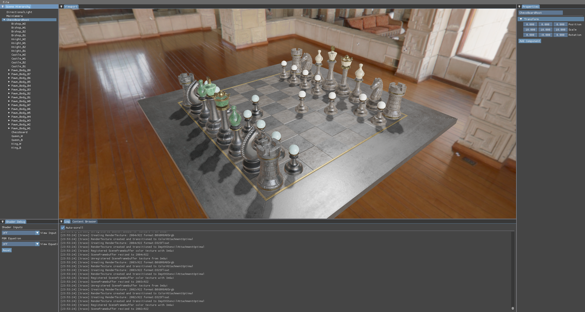

# Fishy Engine

Fishy Engine is a lightweight, modern rendering engine built with modern C++, Vulkan 1.3+, and an Entity-Component-System (ECS) architecture.



## Design Philosophy

The engine is engineered around the principle of "Simple & Good", prioritizing explicit control and architectural clarity over hidden behavior.
- Strict separation of data (Components) and logic (Systems) using EnTT.
- Explicit frame loop orchestration and modern Vulkan lifecycle management.
- Complete embrace of modern C++ paradigms.

## Technical Details

- **Language:** C++23
- **Graphics API:** Vulkan 1.3+ (Dynamic Rendering)
- **Shader Language:** Slang
- **Architecture:** ECS via EnTT
- **Dependencies:**
  - Vulkan Bootstrap & Volk (Initialization)
  - VulkanMemoryAllocator (Memory Management)
  - vulkan-hpp (C++ RAII Bindings)
  - fastgltf (glTF 2.0 Loading)
  - libktx & stb_image (Texture Loading)
  - GLM (Mathematics)
  - Dear ImGui (UI, Docking Branch)
  - spdlog (Logging)

## Core Features

### Rendering & Ray Tracing
- [x] PBR pipeline (Cook-Torrance BRDF)
- [x] Image Based Lighting (IBL)
- [ ] Shadows
  - [x] Directional Light PCF Shadows (Max 16 lights, sharing a 4096x4096 shadow atlas)
  - [ ] Point & Spot Light Shadows
- [x] CPU coarse culling
- [ ] Transparent & Opaque render queues
- [ ] Shader hot-reloading
- [ ] Hardware Accelerated Ray Tracing (Vulkan Ray Tracing Pipeline / Ray Queries)

### Engine Architecture & Vulkan
- [x] ECS Architecture via EnTT
- [x] VMA-backed buffer and image abstractions
- [ ] Asynchronous resource streaming (via dedicated transfer queue)
  - [ ] ThreadPool based on std::jthread
  - [ ] Dedicated transfer queue
- [ ] Runtime entity/model instantiation and destruction
- [ ] Runtime component attachment and detachment

#### GPU Driven Pipeline
- [x] Bindless Textures for material sampling
- [x] Buffer Device Address (BDA) & Push Constants for SSBO/UBO access
- [ ] GPU driven culling(Compute-based)

### Resources & glTF 2.0
- [x] Static mesh parsing
- [x] Automatic texture and cubemap loading
- [ ] glTF Material Extensions
  - [ ] Transmission
  - [ ] Clearcoat

### Editor & Tools
- [x] ImGui-based editor interfaces
  - [x] Scene Hierarchy with parent-child tree
  - [x] Properties inspection
  - [x] Real-time Log window
  - [ ] Content Browser
- [x] Unified logging system (Console, File, RingBuffer)

## Project Structure

- `src/core/`: Application loop, window management, and Vulkan base context.
- `src/ecs/`: Pure data components (Transform, Mesh, Camera) and stateless systems (Render, Lighting).
- `src/renderer/`: Graphics pipelines and Vulkan rendering wrappers.
- `src/resources/`: Asset loaders for models and environments.
- `src/scene/`: Scene management entity wrappers.
- `src/ui/`: ImGui editor layer integrations.

## Build Instructions

**Requirements:**
- Vulkan SDK 1.3+
- C++23 Compiler (MSVC 2022 v17.1+ / GCC 12+ / Clang 14+)
- CMake 3.20+

**Steps:**
```bash
git clone https://github.com/your-repo/Fishy.git
cd Fishy
mkdir build && cd build
cmake ..
cmake --build . --config Release
```

## License

MIT License
