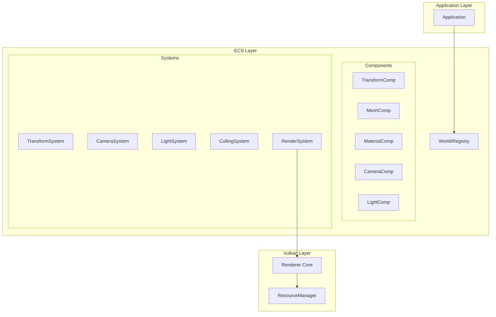

# TODOS

## 🔴 High Priority (Critical Bugs & Performance)

*(All items completed and archived)*

## 🟡 Medium Priority

- [ ] **Shader Reflection System (REQ-R-04)**
  - Integrate SPIRV-Reflect library
  - Add `ShaderReflection` struct for vertex inputs and descriptor bindings
  - Auto-generate `PipelineVertexInputStateCreateInfo` and `DescriptorSetLayout`
  - Validate shader/Material compatibility (glTF standard binding order)
  - Cache reflection results in `ResourceManager`
  - Eliminates manual layout duplication between C++ and shader

- [ ] **Transfer Queue Async Upload (REQ-P-02)**
  - Add dedicated transfer queue to `VulkanDevice` (query vkb::QueueType::transfer)
  - Implement async resource upload with timeline semaphore sync
  - Don't block graphics queue during texture/mesh loading
  - Consider double-buffered staging buffer pool

- [ ] **Mipmap Generation (REQ-P-03)**
  - Generate mipmaps using `vkCmdBlitImage` chain
  - Calculate mip levels: `floor(log2(max(width, height))) + 1`
  - Update Sampler with `VK_SAMPLER_MIPMAP_MODE_LINEAR` and proper `maxLod`
  - Enable anisotropic filtering (already have `samplerAnisotropy` feature enabled)

- [ ] **KTX2 Texture Support (REQ-M-02)**
  - Integrate libktx or Compressonator SDK
  - Support BC7 (high quality), BC5 (normal maps), ASTC (mobile)
  - Load pre-generated mipmaps from KTX2
  - Consider GPU transcoding with Basis Universal

- [ ] **ImGui Integration and Input Handling (REQ-I-02)**
  - Complete ImGuiLayer implementation
  - Add Scene Hierarchy panel with tree view
  - Add Inspector panel for component editing
  - Add Asset Browser with thumbnail preview
  - Add render statistics overlay (draw calls, triangles, GPU time)

## 🔧 Renderer Design Improvements

- [ ] **Multi-Pipeline Support for Different Materials**
  - Current: Single GraphicsPipeline for all objects
  - Need pipelines for: Opaque, Alpha-Mask, Alpha-Blend, Double-Sided
  - Select pipeline based on `Material::alphaMode` and `doubleSided` flags
  - Consider pipeline derivatives for faster creation

- [ ] **Depth Pre-Pass (Z-Prepass)**
  - First pass: Depth-only rendering to fill depth buffer
  - Second pass: Use `DepthCompareOp::eEqual` to avoid overdraw
  - Significant performance gain for scenes with high depth complexity

- [ ] **Remove Blocking waitIdle() in Resource Creation**
  - Current: `waitIdle()` called in depth resource creation (Renderer.cpp:587)
  - Problem: Blocks GPU during swapchain recreation
  - Fix: Use proper fence-based synchronization or per-resource fences
  - Same issue in staged buffer uploads

- [ ] **Secondary Command Buffers for Parallel Recording**
  - Separate scene rendering and UI into secondary command buffers
  - Enables multi-threaded command recording
  - Current: Single primary command buffer for everything

## 🏗️ Architecture Improvements

- [ ] **Decouple Renderer from Scene Logic**
  - Current: `Renderer::render()` directly iterates over `Model` primitives
  - Problem: Violates single responsibility, hard to extend
  - Solution: Introduce `RenderQueue` or `DrawList` abstraction
  - Renderer should only receive pre-sorted draw commands

- [ ] **Resource Lifetime Management with Reference Counting**
  - Current: ResourceManager uses raw pointers for GPU resource lookup
  - Problem: Dangling references if CPU-side objects are destroyed
  - Solution: Use handle-based system with generation IDs
  - Or use `std::weak_ptr` for cache entries

- [ ] **Frame Resource Ring Buffer**
  - Current: Fixed `MAX_FRAMES_IN_FLIGHT = 2` with hardcoded arrays
  - Improvement: Create proper `FrameResources` struct with all per-frame data
  - Easier to manage and extend frame-local resources

- [ ] **Proper Error Handling Strategy**
  - Current: Mix of exceptions and return codes
  - Standardize on one approach: prefer exceptions for initialization
  - Add recovery paths for runtime errors (e.g., swapchain recreation)

- [ ] **Configuration System**
  - Current: Hardcoded values (pool sizes, swapchain format preferences)
  - Add engine configuration file (JSON/TOML)
  - Runtime-adjustable graphics settings

- [ ] **Render Graph / Frame Graph System**
  - Abstract render pass dependencies and resource transitions
  - Automatic barrier placement and resource aliasing
  - Foundation for deferred rendering, post-processing, shadows

## 🎨 Graphics Features (Future)
w
  - Directional light shadow maps (cascaded for large scenes)
  - Point light shadow cubemaps
  - Percentage-closer filtering (PCF)

- [ ] **Screen-Space Ambient Occlusion (SSAO)**
  - Post-processing pass for contact shadows
  - HBAO+ or GTAO algorithms

- [ ] **HDR Rendering and Tone Mapping**
  - Current: Reinhard tone mapping only
  - Add ACES, Uncharted 2, AgX options
  - Exposure control (auto-exposure)
  - Bloom effect

- [ ] **Anti-Aliasing Options**
  - MSAA support (sample count configuration)
  - FXAA/TAA post-processing options

## 🟢 Low Priority / Future

- [ ] **Dynamic Descriptor Allocator (REQ-M-03)**
  - Implement growable descriptor pool
  - Support per-frame pool reset
  - Remove fixed pool size limits

- [ ] **Resource Hashing (REQ-M-04)**
  - Replace string keys with hash IDs (size_t/uint64_t)
  - Faster resource lookup

- [ ] **TransformSystem (REQ-S-02)**
  - Use `std::vector<glm::mat4>` for contiguous storage
  - Scene nodes store only index IDs
  - Batch matrix updates

- [ ] **Frustum Culling (REQ-S-03)**
  - Implement CPU AABB culling
  - Output visible object indices

## 🏗️ ECS Architecture (Future Refactor)

> Migrate from current OOP architecture to Entity-Component-System for better data locality and extensibility

### Architecture Diagram

### Renderer Role Changes After ECS

After ECS migration, `Renderer` becomes a **low-level Vulkan wrapper** without scene logic:
- ❌ No longer iterates over Model/Primitives
- ❌ No longer owns Camera
- ✅ Only handles beginFrame/endFrame, pipeline binding, draw command recording

`RenderSystem` becomes the new rendering entry point: queries entities, sorts, calls Renderer.

### Entity & World Management
- [ ] **Entity Manager**
  - Implement Entity ID system (sparse set or generational index)
  - World/Registry manages all entities and components
  - Consider using [entt](https://github.com/skypjack/entt) or custom implementation

### Components (Pure Data)
- [ ] **TransformComponent**
  - `glm::vec3 position, rotation, scale`
  - `glm::mat4 localMatrix, worldMatrix`
  - `EntityID parent` (hierarchy relationship)

- [ ] **MeshComponent**
  - `MeshHandle meshId` (points to Mesh in ResourceManager)
  - `AABB boundingBox`

- [ ] **MaterialComponent**
  - `MaterialHandle materialId`
  - Runtime material parameter overrides

- [ ] **CameraComponent**
  - `float fov, nearPlane, farPlane`
  - `glm::mat4 viewMatrix, projMatrix`
  - `bool isActive`

- [ ] **LightComponent**
  - `LightType type` (Directional, Point, Spot)
  - `glm::vec3 color, float intensity`
  - `float range, innerCone, outerCone`

### Systems (Logic)
- [ ] **TransformSystem**
  - Calculate hierarchical transforms (parent-child)
  - Update all dirty worldMatrix entries
  - Upload transform data to GPU (SSBO)

- [ ] **CameraSystem**
  - Update active camera's view/projection matrices
  - Handle camera input controls

- [ ] **LightSystem**
  - Collect all lights in the scene
  - Upload light data to GPU UBO/SSBO

- [ ] **CullingSystem**
  - Frustum Culling
  - Occlusion Culling (optional)
  - Output visible entity list

- [ ] **RenderSystem**
  - Get visible entities from CullingSystem
  - Sort by material (reduce state changes)
  - Record draw commands
  - Manage render passes (Depth, Forward, UI)

- [ ] **UISystem**
  - ImGui rendering
  - Handle UI input

### Migration Path
1. First implement Components and basic World
2. Gradually migrate Renderer logic to RenderSystem
3. TransformSystem replaces current Model matrix handling
4. Finally migrate Camera and Light

## ✅ Archived

- [x] **Fix render loop heap allocations (REQ-P-06)** ✅ 2025-01-01
  - Replaced `std::vector<vk::DescriptorSet>` with stack-based binding
  - Moved Set 0 binding outside the loop (only Set 1 binds per-primitive)
  - Related: NFR-03 (Zero-allocation render loop)

- [x] **Implement Pipeline Cache (REQ-P-01, REQ-R-05)** ✅ 2025-01-01
  - Added `vk::raii::PipelineCache` to `Renderer`
  - Load cache from disk on startup (`pipeline_cache.bin`)
  - Save cache to disk on shutdown
  - Pass cache to `PipelineBuilder::build()`

- [x] **Instanced/Indirect Rendering (REQ-P-04)** ✅ 2025-01-01
  - Group primitives by material for instanced rendering
  - Implement `vkCmdDrawIndexedIndirect`
  - Reduce draw call overhead for 500+ objects (NFR-01)

- [x] **Fix PBR material texture formats** ✅ 2025-01-01
  - Fixed `metallicRoughnessTexture` to use `eR8G8B8A8Unorm` (data texture, not color)
  - Fixed `occlusionTexture` to use UNORM (data texture)
  - Fixed `clearcoatTexture/clearcoatRoughnessTexture` to use UNORM
  - Fixed `transmissionTexture` to use UNORM

- [x] **Fix shader alphaRoughness calculation** ✅ 2025-01-01
  - Changed `float alphaRoughness = perceptualRoughness * perceptualRoughness;`
  - Correct PBR specular highlights

- [x] **Optimize Descriptor Set Binding** ✅ 2025-01-01
  - Bind Set 0 once outside the loop, only bind Set 1 (Material) per primitive
  - Reduces redundant descriptor set binding overhead

- [x] Integrate a simple logging system: use spdlog! ✅ 2025-12-27
  - Added LogSystem class with spdlog integration
  - Multi-sink output: console (color), file, ringbuffer (for ImGui)
  - Source location tracking using std::source_location
  - Vulkan debug callback integration

- [x] **Bindless Descriptors (REQ-P-05)** ✅ 2025-01-03
  - Implement Descriptor Indexing extension
  - Use texture arrays with material indices
  - Reduce descriptor set switching overhead

- [x] **Vertex/Index Buffer Batching** ✅ 2025-01-03
  - Merge vertex/index data into single large buffers per scene
  - Use `firstIndex` and `vertexOffset` parameters instead of rebinding
  - Implemented via `Renderer::buildUnifiedBuffers`

- [x] **Per-Object Model Matrix with Bindless SSBO** ✅ 2025-01-03
  - Implemented `g_Instances` SSBO in Set 2
  - Supports separate transform for every object instance

- [x] **Material Sorting / Batching** ✅ 2025-01-03
  - Superceded by Bindless implementation
  - Unified draw calls reduce need for frequent descriptor switches

- [x] **Proper Inverse Normal Matrix for Non-Uniform Scaling** ✅ 2025-01-03
  - Fixed in PBR shader using normal matrix from SSBO instance data

- [x] **Image-Based Lighting (IBL)** ✅ 2025-01-03
  - Add environment cubemap support
  - Pre-filtered environment map for specular
  - Irradiance map for diffuse
  - Integrates with existing PBR shader